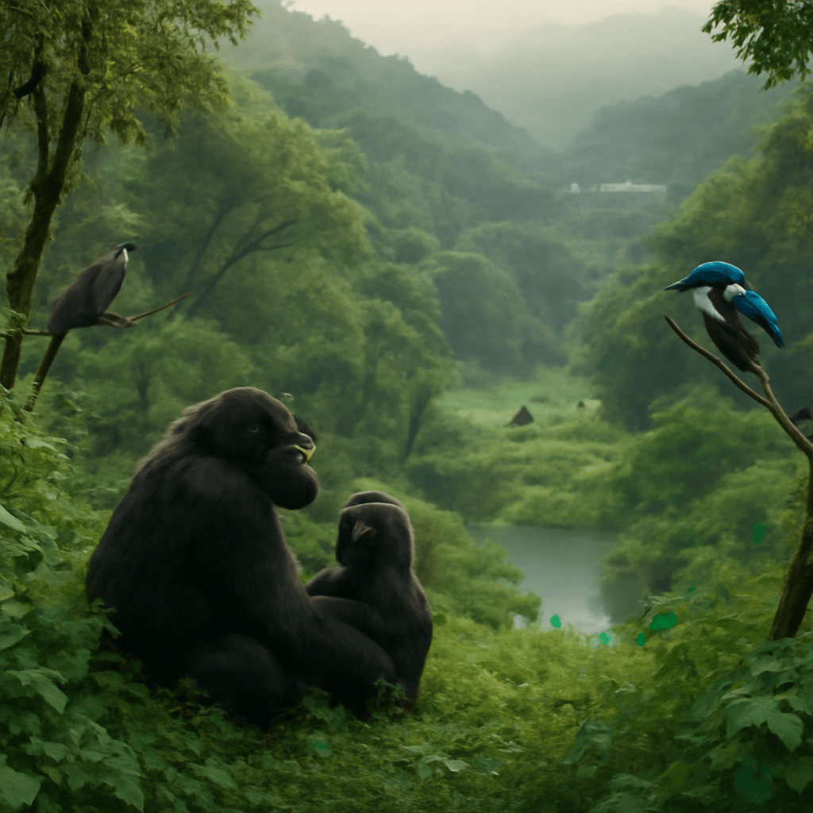

[2025/08/09(土)]

ワシじゃ。今日も森の息吹を感じながら歩いたんじゃよ。綾羽高校のそばは自然が豊かで、若い連中がのびのびと個性を伸ばしておる様子が目に浮かぶ。そんな森の静けさの中、カッコウの鳴き声がはっきりと響いておったな。あの托卵という習性には感心すると同時に、自然の厳しさも垣間見えるんじゃ。水辺では鮮やかなブルーとオレンジのカワセミが素早く魚を捕る姿に見惚れたぞい。彼らは静かに近づくと本当に羽音も立てず、まるで忍者のようじゃ。散歩の途中で食べた桃は、口いっぱいに甘みが広がり、自然の恵みに感謝せずにはおれんかった。ただ食べ過ぎは禁物じゃな、ワシのお腹もびっくりするからな。最後にエミューの姿も見かけたが、あの大きな身体で速く走り、羽は暑さを凌ぐために使われるとは知らなんだ。自然の営みは実に奥深いと改めて感じた一日じゃった。

