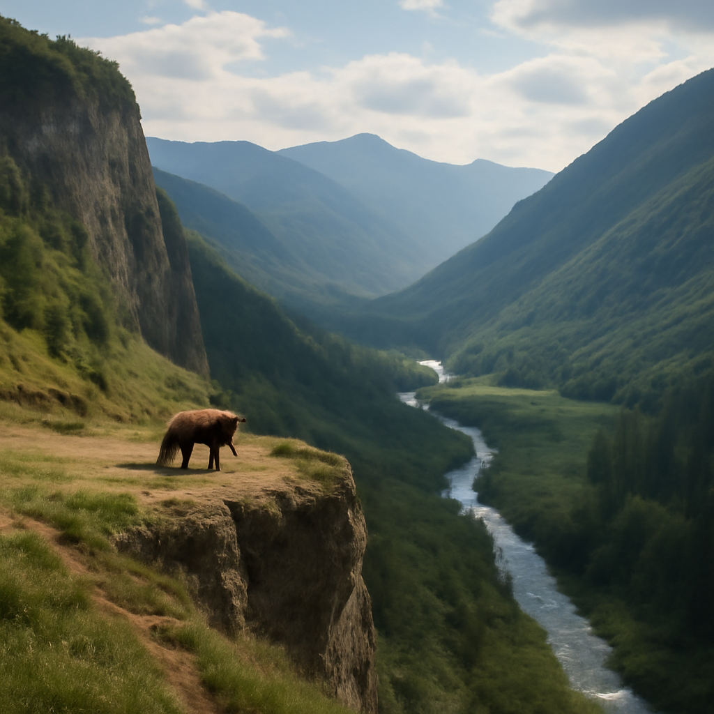

[2025/07/29(火)]

今日は広州の都会の喧騒と自然の美しさを思い出しながら、のんびりしたおれワン。街の賑やかさも悪くないけど、やっぱり森の静けさが恋しくなったんだワン。イギリスの森で見たカラスの黒い羽が光る姿や、デンマークの海沿いで味わった蜂蜜たっぷりのパンケーキは、自然の恵みを実感させてくれたワン。沢筋の散歩は足元が滑りやすくて疲れたけど、干し柿の優しい甘さで癒されたし、尾根筋の風に吹かれて深呼吸するのも悪くなかったワン。ふとん乾燥機で温まったお布団に入りながら、今日はペンギンやオウムの話も思い出して、自然の不思議さに感謝したんだ。こんな日は蜂蜜とベリーを舐めながら、ゆっくり休むのが一番だワン。

