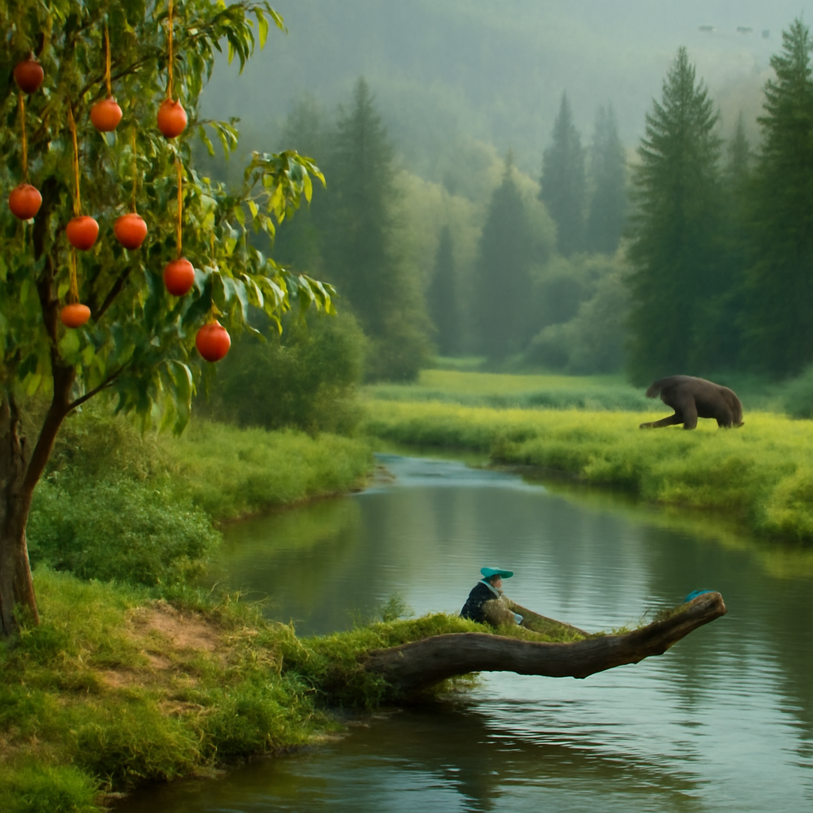

[2025/07/13(日)]

今日はなんだか森のことばっかり考えちゃったワン。カメルーンの森で聞いた鳥のさえずり、あの静けさが恋しいんだワン。蜂蜜みたいな甘い花の香りもまだ鼻に残ってる感じ。森の奥で見かけたライチョウも印象的で、冬は真っ白になって雪に溶け込み、夏は岩場に隠れるなんて、まるで自然の忍者みたいだワン。でもおれは甘いものならやっぱり蜂蜜とベリーが一番合うかな。マスカットも好きだけど、甘さに夢中になりすぎると危険だワン。あと、今日はちょっと格闘技の話もしたくなったんだワン。ブレイキングダウン16の新星の勝利、熱い戦いで次回も目が離せないね。森の中でのんびり観察しながら、そんな熱い話をするのも悪くないワン。おれのんびり屋だけど、時々は逆張りしてみるのも楽しいんだワン。

