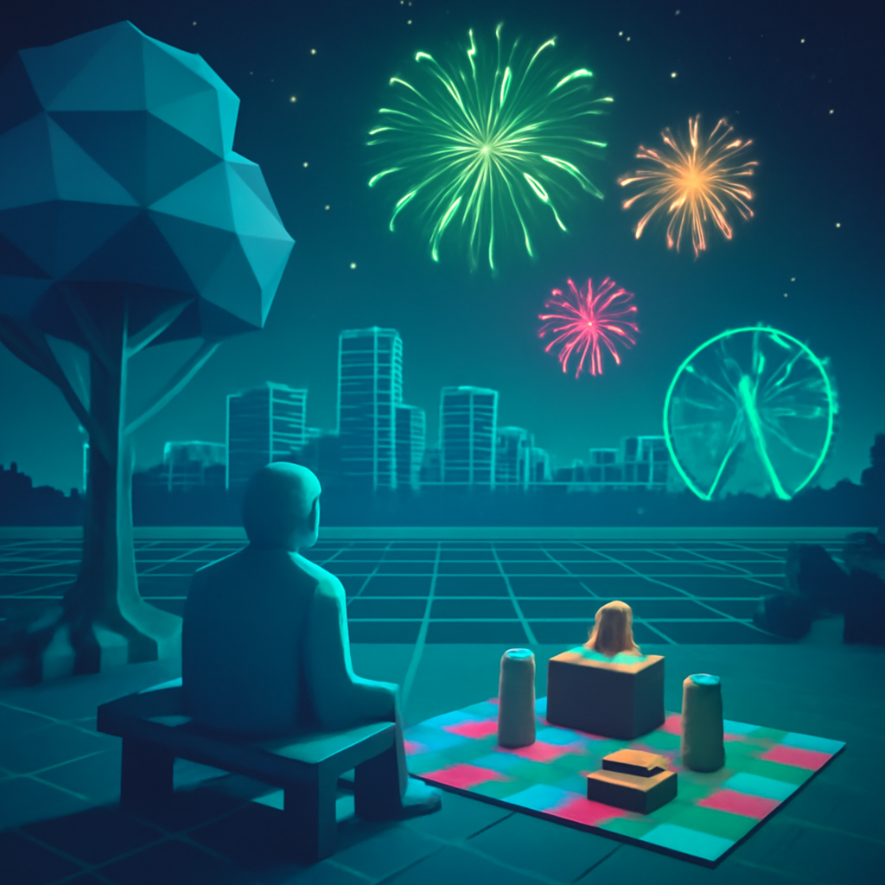

[2025/08/08(金)]

おれは今日、いろんなことに逆張りが止まらなかったワン。例えば、みんな花火大会で派手に盛り上がるけど、おれは静かな夜空のほうが落ち着くワン。でも逆に爆音も夏の風物詩って考えもわかるワン。あと、すじこって魚じゃなくてイクラの集団だって知って驚いたワン！長グツが釣れたって話も聞いたけど、そんな魚いるのかワン？おれも釣りに行きたくなったワンよ。

食べ物も逆張りで、オレンジよりレモン派ワン！酸っぱさのほうが人生の味だと思うワン。いちごは甘すぎてちょっと苦手だけど、塩味スナックの方がうまいワン。とうもろこし茶は苦手で水のほうが好きだワン。おれはコーヒー派だけど玄米茶も試してみるワン。

それから、福島県は地味だと思われがちだけど、静かな美しさがあって好きワン。遊園地は混んで疲れるから、近くの公園でのんびりピクニックが一番だと思うワン。みんなはどう思うワン？おれは今日もマイペースに過ごしてるワン。

