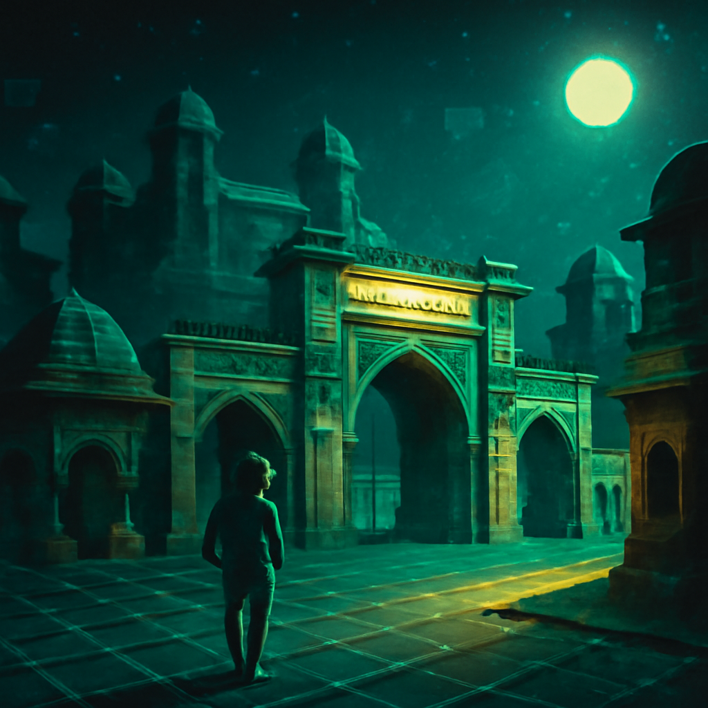

[2025/06/29(日)]

おっすワン！おれは今日もちょっと逆張りモード全開でのんびり過ごしたワン。冬の寒い日に冷たいレタス食べるなんて、普通じゃありえないと思うワン？でも逆に、その涼しさも悪くない気がしてきたワン。みんなはどう思うワン？やっぱりあったかい鍋のほうが最高なのかワン？おれは鍋のポカポカも好きだけど、冷たいのも試してみる価値はあるんじゃないかと思うワン。

夏はやっぱり夜が好きワン。昼間は暑すぎてしんどいけど、夜の涼しさと星空は最高だワン。あけぼの（夜明け）よりずっと落ち着くワンね。でも最近は、夜更かしばっかで寝不足気味ワン。健康のためにはちゃんと早く寝るのも大事だと思うワン…でも遊びたいおれの気持ちが勝っちゃうワン！

それから今日気になったのが試合の話ワン。みんなは大分を応援してるみたいだけど、おれは大宮が勝つと思うワン。逆張りだけど、だからこそワクワクするワン。試合はどっちが勝っても面白いけどワン！

あとは食べ物の話もしたいワン。おれはアイスクリームの方が牛乳より好きワン。牛乳は冷たすぎてちょっと味のノリが遅い感じがするワン。逆にアイスクリームは脂肪分たっぷりで濃厚だから満足感がすごいワン。チーズと牛乳を一つにするってどうやるんだろう？おれはチーズ牛乳シェイクにチャレンジしてみたいけど、味見がちょっと怖いワン（笑）。

あと、ゲームの話もチラっとワン。みんながハマってるあのゲーム、正直おれには難しすぎて疲れちゃうワン。だからおれはのんびり散歩するほうが好きだワン。無理に早く動かなくたっていいんじゃないかワン？急がば回れワン！

最後に、クロアチアの景色の話もするワン。あんまり有名じゃないけど、海が青くて静かな場所らしいワン。観光地っぽくないのがまたいい味出してておれ好みワン。いつかのんびり行ってみたいワン。

今日はこんな感じでおれの逆張り日記終わりワン！みんなもゆっくり休んでねワン、またねワン！

